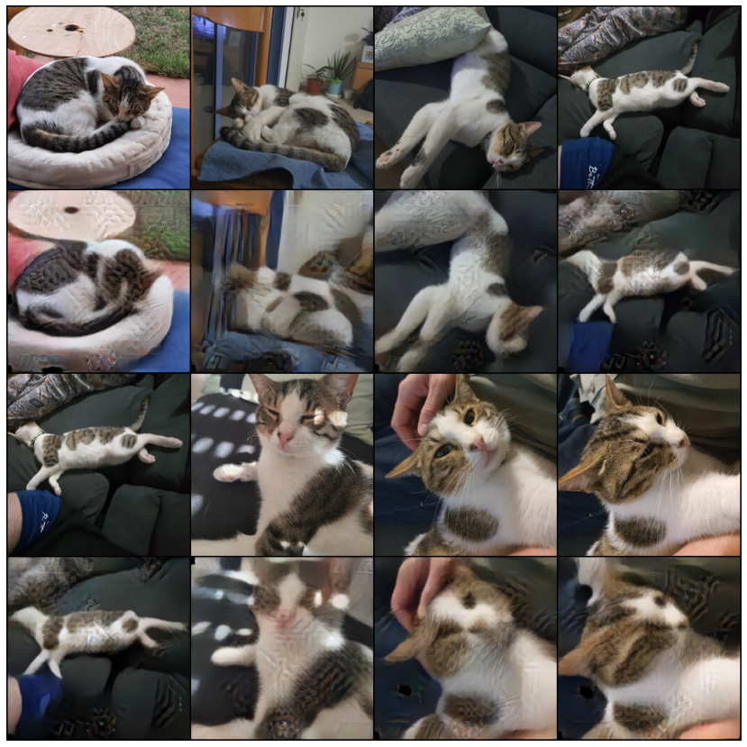
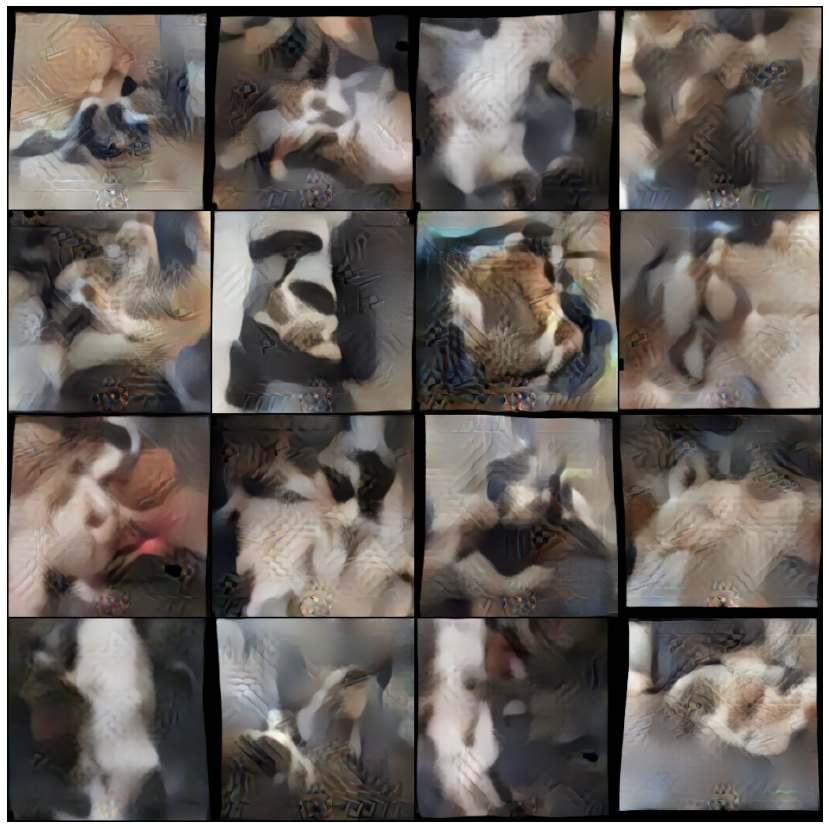
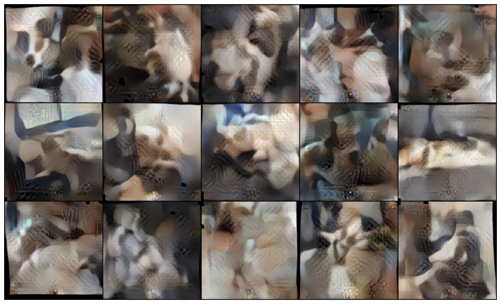
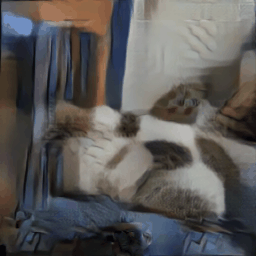
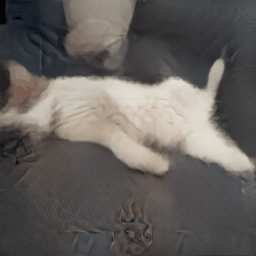
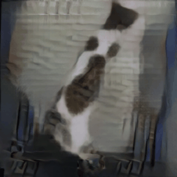
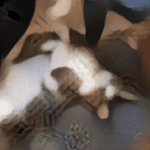
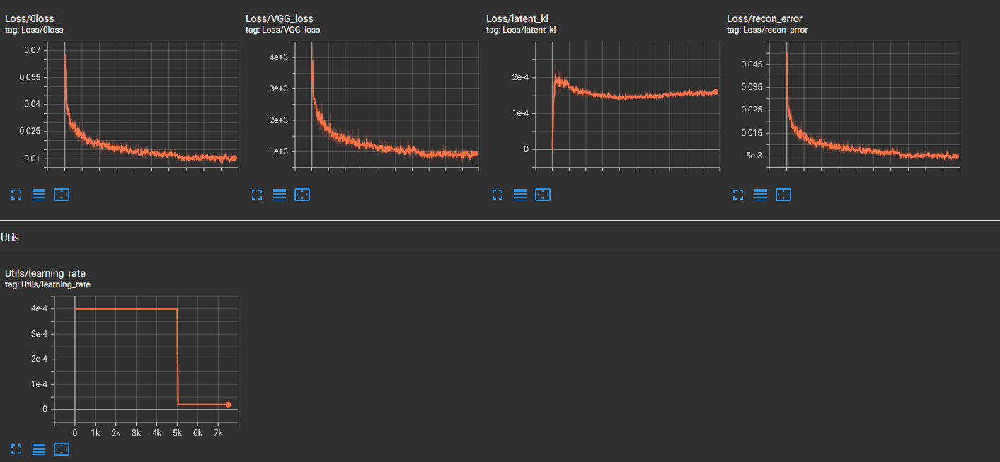

# Model And Improvements
A standard (beta) Vae was used with the following improvements:
* Using desubpixel and subpixel for up sampling and down sampling. This method allows creating smaller
feature maps without losing information like in pooling layers, the image is just split to more channels. 
1x1 convolution are used to reduce the number of channels later (for fewer parameters in the fully 
connected layers). This improvement is inspired by 
[this paper](https://openaccess.thecvf.com/content_ECCVW_2018/papers/11133/Vu_Fast_and_Efficient_Image_Quality_Enhancement_via_Desubpixel_Convolutional_Neural_ECCVW_2018_paper.pdf
)
* VGG perceptual loss is used as an addition to the regular reconstruction loss. In VAE's, MSE or BCE loss is
usually used as the reconstruction loss which produces sharp photos because it makes improves the reconstruction
error on average of all pixels, but ignores the relations between neighboring pixels. VGG loss passes both
original image and reconstructed image through the first few feature layers of VGG pretrained network and 
then uses MSE loss. this makes sharper reconstructions.
inspired by [this paper](https://arxiv.org/pdf/1603.08155.pdf)

Generally, a very deep model with residual blocks was used. In order to reduce the amount of trained parameters,
which lay mostly in the fully connected layers, 1x1 convolution was used to reduce the number of channels.

## Final architecture for 256x256 images:
###Encoder

| input: 3x256x256 image batch                                            | output     |
|-------------------------------------------------------------------------|------------|
| 1x1 convolution to create feature maps followed by Leaky RELU           | 8x256x256  |
| 5 Residual Blocks* of 3x3 convolution                                   | 8x256x256  |
| Subpixel (nn.PixelUnshuffle) with factor of 2                           | 32x128x128 |
| 1x1 convolution                                                         | 16x128x128 |
| 5 Residual Blocks* of 3x3 convolution                                   | 16x128x128 |
| Subpixel (nn.PixelUnshuffle) with factor of 2                           | 64x64x64   |
| 1x1 convolution                                                         | 32x64x64   |
| 5 Residual Blocks* of 3x3 convolution                                   | 32x64x64   |
| Subpixel (nn.PixelUnshuffle) with factor of 2                           | 128x32x32  |
| 1x1 convolution                                                         | 64x32x32   |
| 5 Residual Blocks* of 3x3 convolution                                   | 64x32x32   |
| 1x1 convolution + Leaky RELU                                            | 32x32x32   |
| 1x1 convolution + Leaky RELU                                            | 16x32x32   |
| 1x1 convolution + Leaky RELU                                            | 8x32x32    |
| FC layer with output of 512 units and Leaky RELU                        | 512        |
| Layer Norm                                                              | 512        |
| FC layer with output of 256 units and Leaky RELU                        | 256        |
| Layer Norm                                                              | 256        |
|                                                                         |            |
| Two identical FC layers followed by Leaky Relu (for $\mu$ and $\sigma$) | 256x2      | 
| Two Identical FC layers to produce 128 vectors for $\mu$ and $\sigma$)  | 128x2      |
*Residual blocks are composed of the following layers where the output is the result added to the input:
* 3x3 convolution
* Leaky RELU
* 3x3 convolution

# Visualization

More visualizations can be seen in [SampleAndVisualize.ipynb](SampleAndVisualize.ipynb).

## Reconstructions

## Samples

### Sampling from $P(Z|X)$
This is done by calculating the mean s.t.d and mean of the entire dataset and sampling from this parameters. 
Actualy a small trick had to be applied to get good images due to some anomalies in the s.t.d vector,
look at [SampleAndVisualize.ipynb](SampleAndVisualize.ipynb).

## Interpolations
|          |    |
|-----------------------------------------------------|---------------------------------------------------|
|  |  |

# Dataset
The data set is made of 1043 images.
273 of them are images taken from my phone during the last year and the rest were
extracted from approximately 50 videos captured with my phone as well. For each second 
in each video, 3 images were taken, then most of them were filtered manually.
Finally, all images were cropped and down-sampled to two data sets:
128x128 and 256x256. The first one was used for experimenting with the architecture. 

## Sampling From The Dataset
The dataset is divided to normal images and images that were extracted from videos. 
The reason is that the images that were taken from videos have lower quality and repetitive,
therefore, during training they were sampled with lower probability of p=0.5. Recall that 
There are match more images from videos then normal images which makes this probability
lower than just drawing random image from the entire dataset.

# Training

The model was trained for 5k episodes with learning rate of 4e-4 and 2.5k more epochs
with learning rate of 2e-5.
The hyper-parameters used for training are [here](checkpoints/256final/params.txt)
## Augmentation
During training, the following augmentations were performed on each sample:
* Random warp perspective with distortion rate of 0.1, it can be seen that generated images are
also warped and have some black pixel near the edges
* Random crop with ratio between 0.8 and 1
* horizontal flip with probability of 0.5

# Reproducing